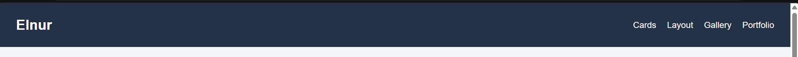
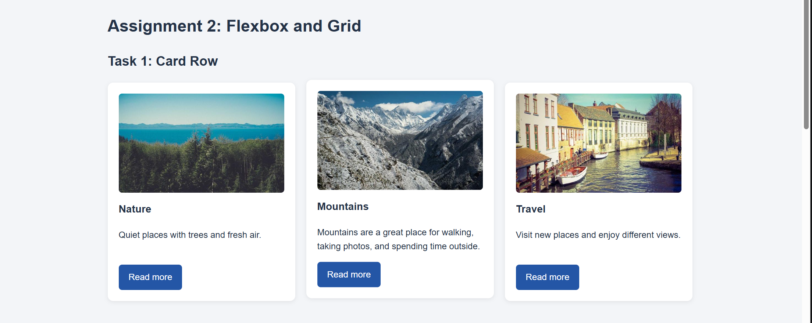
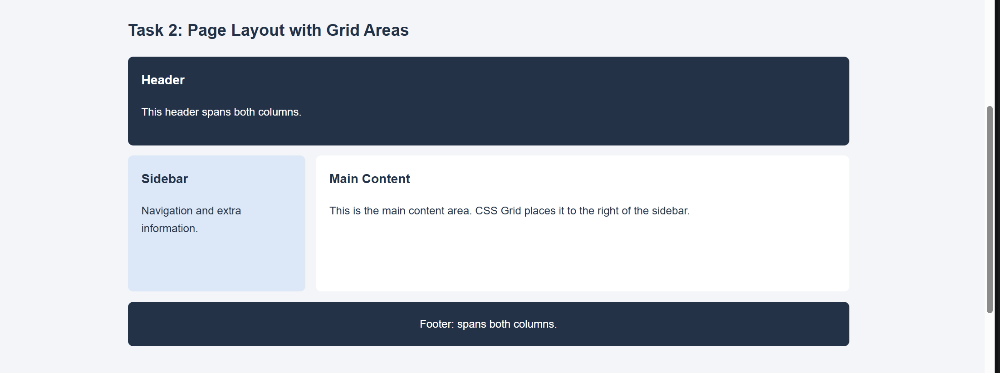
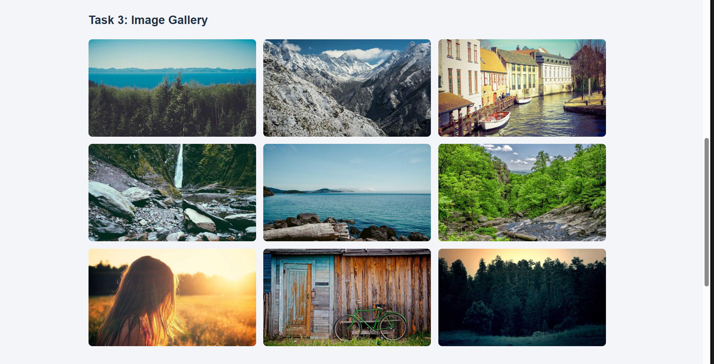
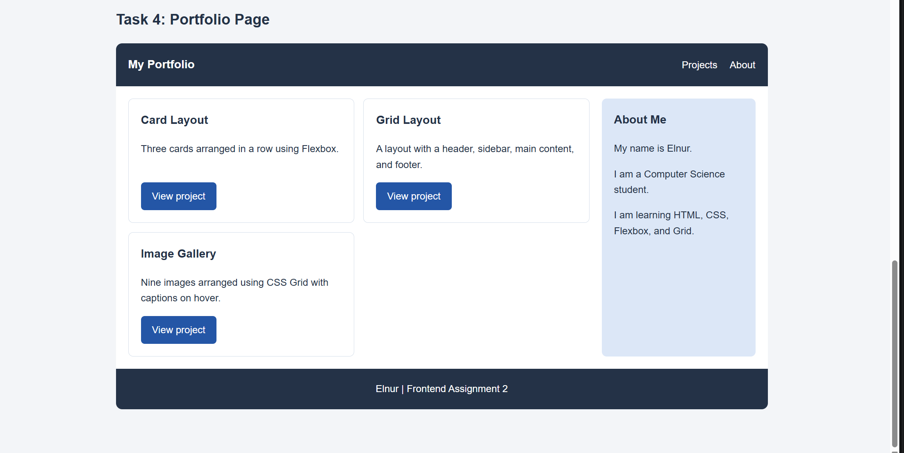

# Assignment 2: Advanced CSS — Flexbox and Grid

Name: Elnur [Your surname]
Group: IT-2513

## About the project

This project is a single webpage with five tasks.
It uses HTML and CSS to demonstrate Flexbox, CSS Grid,
hover effects, and responsive layouts.

## How to open

Download the project and open index.html in a browser.
An internet connection is needed to load the images.

## Part 1: Flexbox

### Task 0: Navigation Bar

The navigation bar has a logo on the left and links on the right.
Flexbox places them in one row.
justify-content separates the logo and the links.
align-items centers them vertically, and gap adds space between links.

### Task 1: Card Row

This section contains three cards.
Each card has an image, a title, text, and a button.

Flexbox arranges the cards in a row with equal heights.
The cards have equal gaps and move up slightly on hover.
The Read more buttons are visual examples without an action.

## Part 2: Grid System

### Task 2: Page Layout with Grid Areas

This layout contains a header, a sidebar, main content, and a footer.
CSS Grid defines the rows and columns.

The header and footer span both columns.
The sidebar is on the left, and the main content is on the right.

### Task 3: Image Gallery

The gallery contains nine images.
CSS Grid places them in three equal columns on wide screens.
The rows have equal heights, and gap adds spacing.

A caption appears over each image on hover.

## Part 3: Combining Flexbox and Grid

### Task 4: Portfolio Page

The portfolio has a header, a main section, a sidebar, and a footer.

The header uses Flexbox for navigation.
The main section uses CSS Grid to place projects on the left
and information on the right.

Each project card uses Flexbox to arrange its title,
description, and project link.
The footer spans the full width of the portfolio.

## Responsive layout

Media queries change the layout on smaller screens.
Cards and portfolio sections move into one column.
The gallery changes from three columns to two, then to one.

## Work process summary

The HTML file defines the page sections and their content.
The CSS file adds colors, spacing, Flexbox layouts,
Grid layouts, and hover effects.
Media queries adapt the page to smaller screens.

## Files

- index.html — page structure and content
- style.css — styles and layouts
- screenshots/ — screenshots of all five tasks
- README.md — project report

## Image source

Images are loaded from https://picsum.photos.