# Assignment 3: Responsive Web Design

Name: Bizhan Elnur
Group: IT-2513

!!! Task 0: Responsive Typography !!!

The heading and paragraph sizes change on mobile, tablet and desktop.

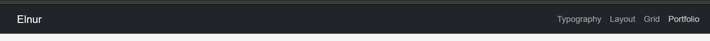

!!! Task 1: CSS Media Queries !!!

The layout uses CSS media queries without Bootstrap grid classes.

- Mobile: one box per row.
- Tablet: two boxes per row.
- Desktop: three boxes per row.

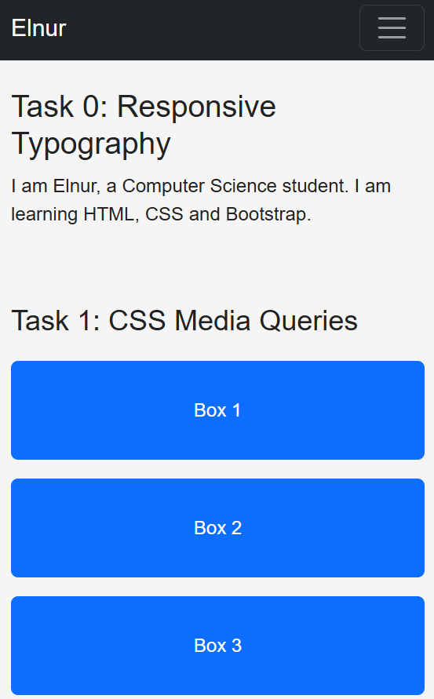
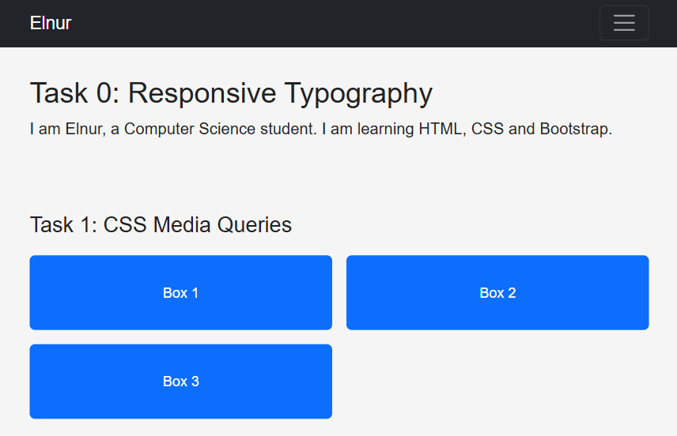
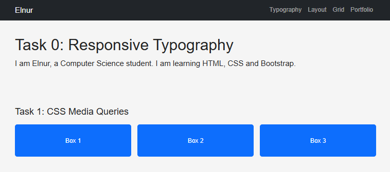

!!! Task 2: Bootstrap Grid !!!

The layout uses the Bootstrap 12-column grid.

- Mobile: each column takes the full row.
- Tablet: two columns in the first row and one in the second.
- Desktop: three equal columns, each taking four grid columns.

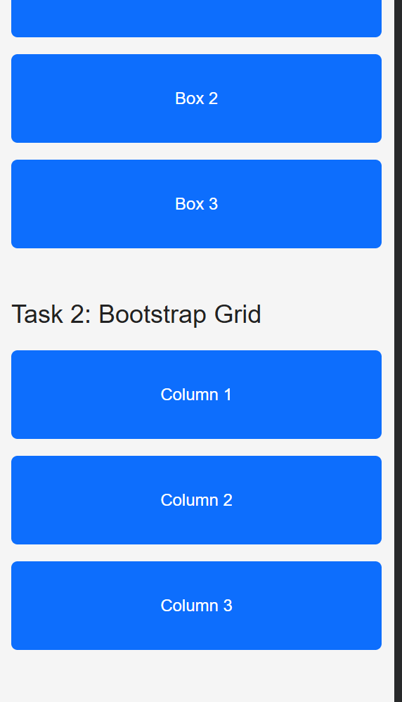
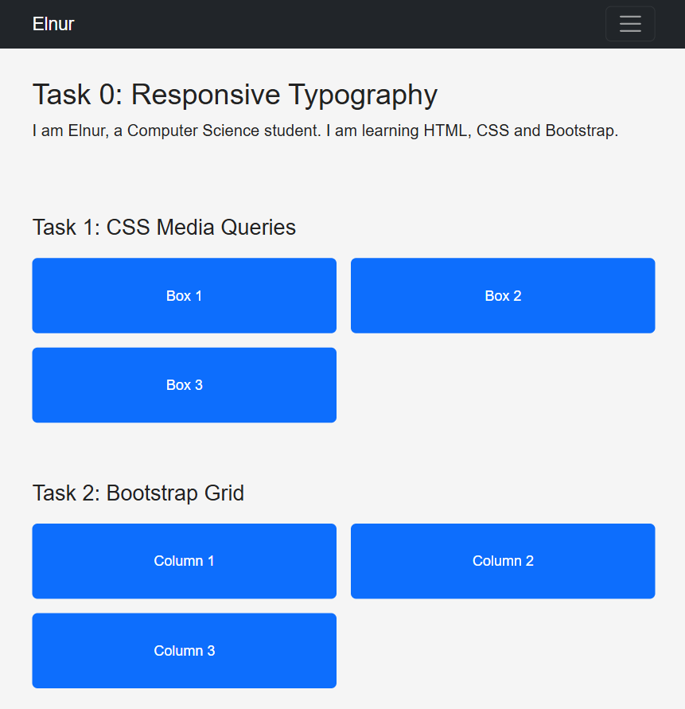
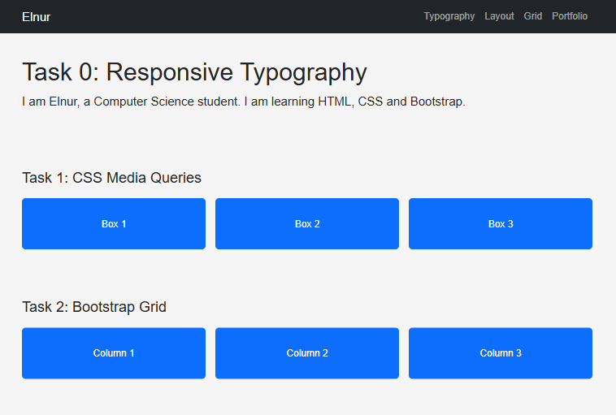

!!! Task 3: Bootstrap Navigation Bar !!!

The navigation bar has a name logo on the left and links on the right.
On smaller screens, the links collapse into a hamburger menu.

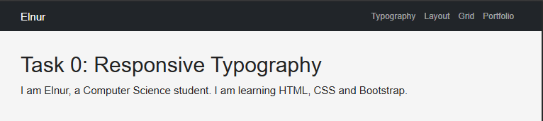
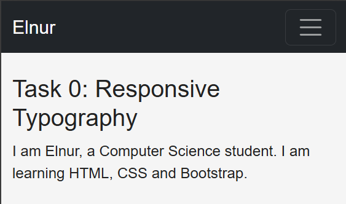

!!! Task 4: Responsive Portfolio !!!

The portfolio includes project cards on the left,
personal information and contact details on the right,
and a footer at the bottom.

Bootstrap grid classes arrange the cards and sidebar.
Custom media queries change font sizes, spacing and text visibility.

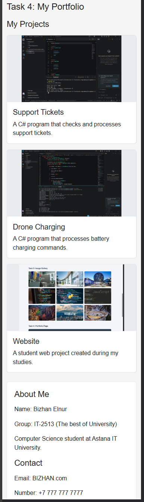
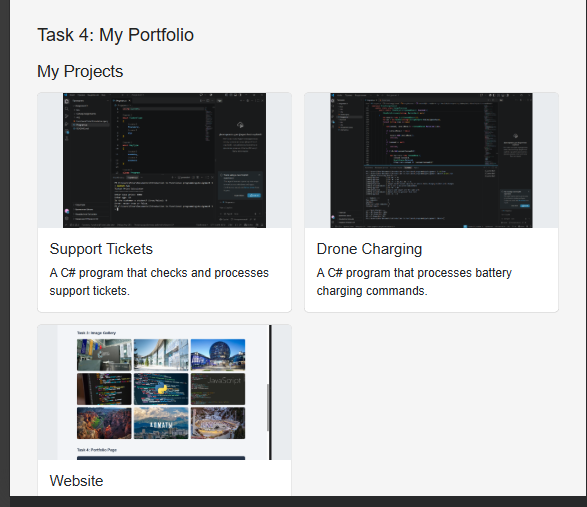
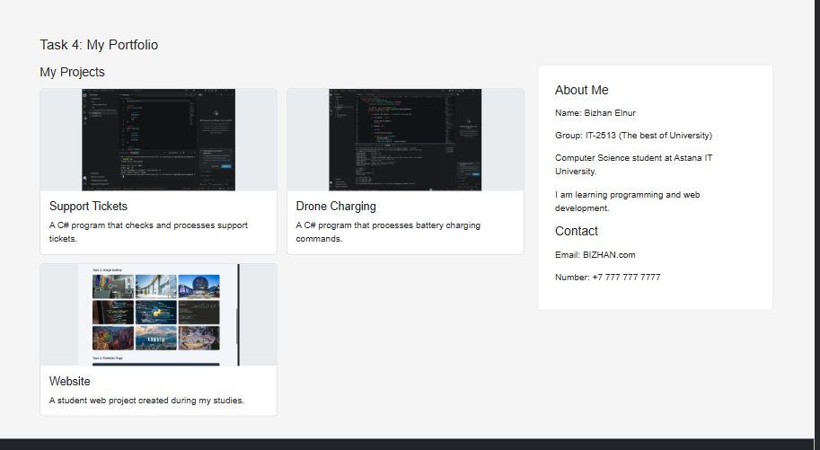

!!! Work Process !!!

I created the HTML structure and added CSS styles.
I used media queries for typography and the box layout.
I added Bootstrap columns, a navigation bar and portfolio cards.

!!! How to Open !!!

Open index.html in a browser.
An internet connection is required to load Bootstrap.